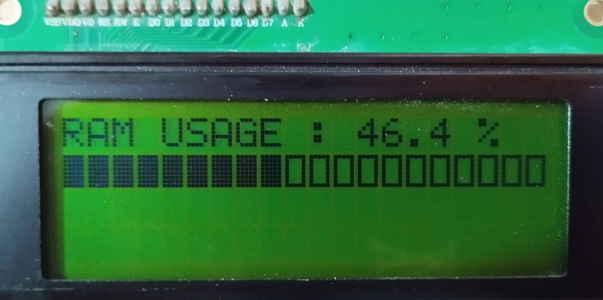

# 🖥️ Arduino PC Monitor

A real-time PC resource monitor built with **Arduino**, **Python**, and a **20x4 I2C LCD**.

The project receives system information from a PC through the Serial port and displays it on an LCD.

## ✨ Features

- Real-time CPU usage monitoring
- Real-time RAM usage monitoring
- Disk usage monitoring
- Current time display
- Visual 20-block progress bar
- Warning system for high resource usage
- Automatic page switching every 4.5 seconds

## ⚠️ Warning Thresholds

| Resource | Warning Level |
|----------|---------------|
| CPU      | 90% or higher |
| RAM      | 85% or higher |
| Disk     | 90% or higher |

## 📸 Project Preview

## 🛠️ Hardware

- Arduino
- 20x4 LCD
- I2C module
- USB cable

## 💻 Technologies

- Arduino / C++
- Python
- Serial Communication
- I2C

## 📡 Data Format

The Arduino receives data in the following format:

`CPU=45|RAM=60|DISK=72|NOW=21:30`

## 🚧 Project Status

This project is currently under development.

## 👤 Author

**Kasra Bashiri**